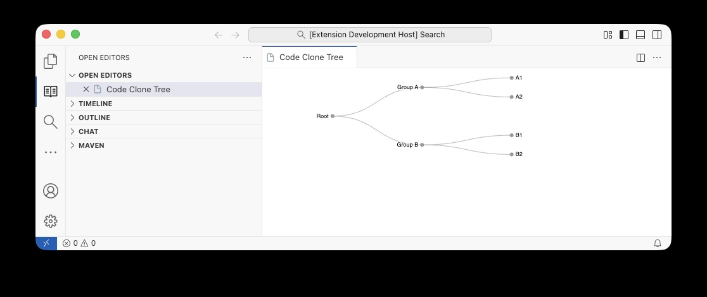
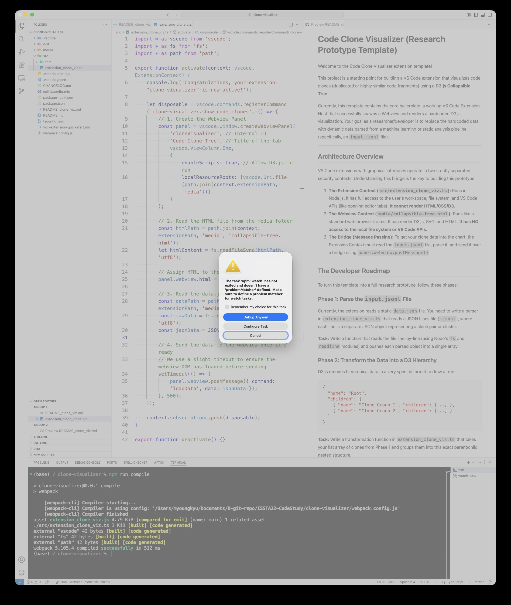

# Code Clone Visualizer (Research Prototype Template)





This project is a starting point for building a VS Code extension that visualizes code clones (duplicated or highly similar code fragments) using a **D3.js Collapsible Tree**.

Currently, this template contains the core boilerplate: a working VS Code Extension Host that successfully spawns a Webview and renders a hardcoded D3.js visualization. Your goal as a researcher/developer is to replace the hardcoded data with dynamic data parsed from a machine learning or static analysis pipeline (specifically, an `input.jsonl` file).

---

## Architecture Overview

VS Code extensions with graphical interfaces operate in two strictly separated security contexts. Understanding this bridge is the key to building this prototype:

1. **The Extension Context (`src/extension_clone_viz.ts`):** Runs in Node.js. It has full access to the user's workspace, file system, and VS Code APIs (like opening editor tabs). **It cannot render HTML/CSS/D3.**
2. **The Webview Context (`media/collapsible-tree.html`):** Runs like a standard web browser iframe. It can render D3.js, SVG, and HTML. **It has NO access to the local file system or VS Code APIs.**
3. **The Bridge (Message Passing):** To get your clone data into the chart, the Extension Context must read the `input.jsonl` file, parse it, and send it over a bridge using `panel.webview.postMessage()`.

---

## The Developer Roadmap

To turn this template into a full research prototype, follow these phases:

### Phase 1: Parse the `input.jsonl` File
Currently, the extension reads a static `data.json` file. You need to write a parser in `extension_clone_viz.ts` that reads a JSON Lines file (`.jsonl`), where each line is a separate JSON object representing a clone pair or cluster.

**Task:** Write a function that reads the file line-by-line (using Node's `fs` and `readline` modules) and pushes each parsed object into a single array.

### Phase 2: Transform the Data into a D3 Hierarchy
D3.js requires hierarchical data in a very specific format to draw a tree:
```json
{
  "name": "Root",
  "children": [
    { "name": "Clone Group 1", "children": [...] },
    { "name": "Clone Group 2", "children": [...] }
  ]
}
```
**Task:** Write a transformation function in `extension_clone_viz.ts` that takes your flat array of clones from Phase 1 and groups them into this exact parent/child nested structure. 

### Phase 3: Feed the Webview
Once your data is transformed, update the `postMessage` call in `extension_clone_viz.ts`:
```typescript
// Send your newly formatted dynamic data instead of the static JSON
panel.webview.postMessage({ command: 'loadData', data: myTransformedTreeData });
```
*Note: The HTML file is already set up to listen for this message and draw the tree!*

### Phase 4: Add Two-Way Interaction (The "Wow" Factor)
A great code clone tool allows the user to click a node in the graph and instantly open that exact file/line in VS Code.

**Task:** 1. In `collapsible-tree.html`, use the VS Code Webview API to send a message *back* to the extension when a node is clicked:
   ```javascript
   const vscode = acquireVsCodeApi();
   // Inside your D3 .on("click") handler:
   vscode.postMessage({ command: 'openFile', filePath: d.data.filePath, line: d.data.lineNumber });
   ```
2. In `extension_clone_viz.ts`, listen for that message and open the editor:
   ```typescript
   panel.webview.onDidReceiveMessage(message => {
       if (message.command === 'openFile') {
           // Use vscode.workspace.openTextDocument and vscode.window.showTextDocument
       }
   });
   ```

---

## How to Run and Debug

1. **Install Dependencies:** (Only needed the first time)
   ```bash
   npm install
   ```
2. **Compile the Code:** Webpack watches your files and compiles TypeScript to JavaScript automatically.
3. **Launch the Extension:**
   - Open `src/extension_clone_viz.ts`.
   - Press **F5** on your keyboard.
   - *Note: If VS Code shows a popup saying "The task 'npm: watch' has not exited", check "Remember my choice" and click **Debug Anyway**. This is normal.*
4. **Trigger the Webview:**
   - In the new "Extension Development Host" window that opens, press **Cmd+Shift+P** (Mac) or **Ctrl+Shift+P** (Windows) to open the Command Palette.
   - Type **"Show Code Clones"** and press Enter.

## Common Pitfalls
* **White Screen in Webview:** This means your D3 script threw a JavaScript error. Open the Webview Developer Tools (`Cmd+Shift+P` -> `Developer: Open Webview Developer Tools`) to see the console logs.
* **Module Not Found (Webpack):** If you rename `extension_clone_viz.ts`, you MUST update the `entry` path inside `webpack.config.js`.
* **Changes Aren't Showing Up:** Always remember to save your TypeScript files (`Cmd+S`) before hitting F5, otherwise the old compiled code will run.